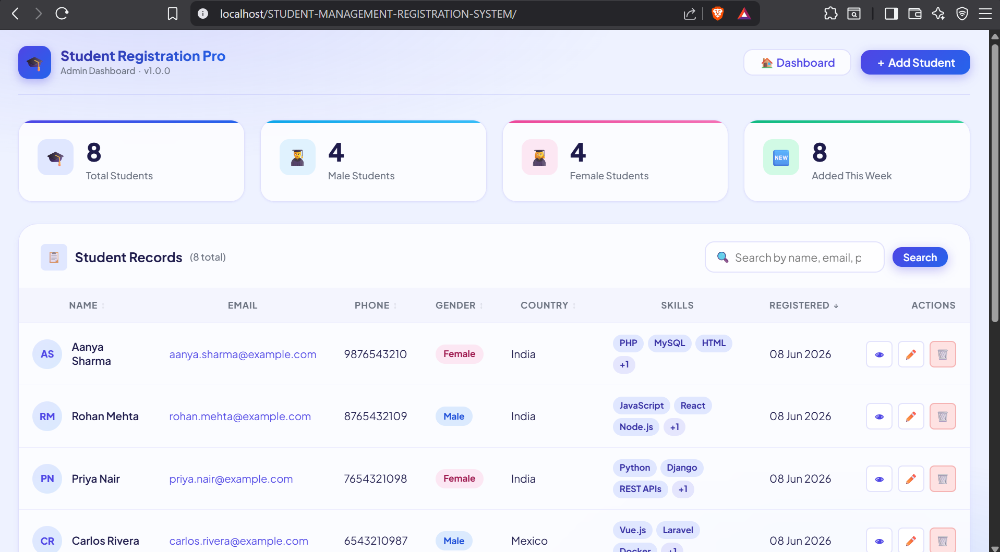
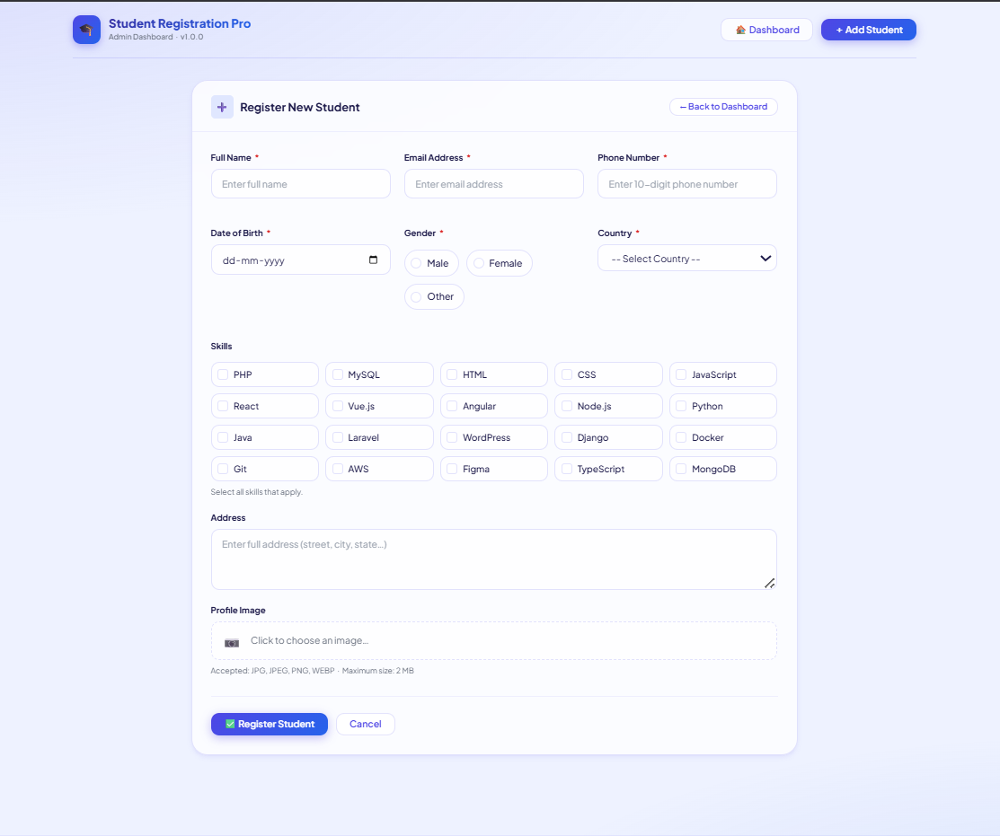
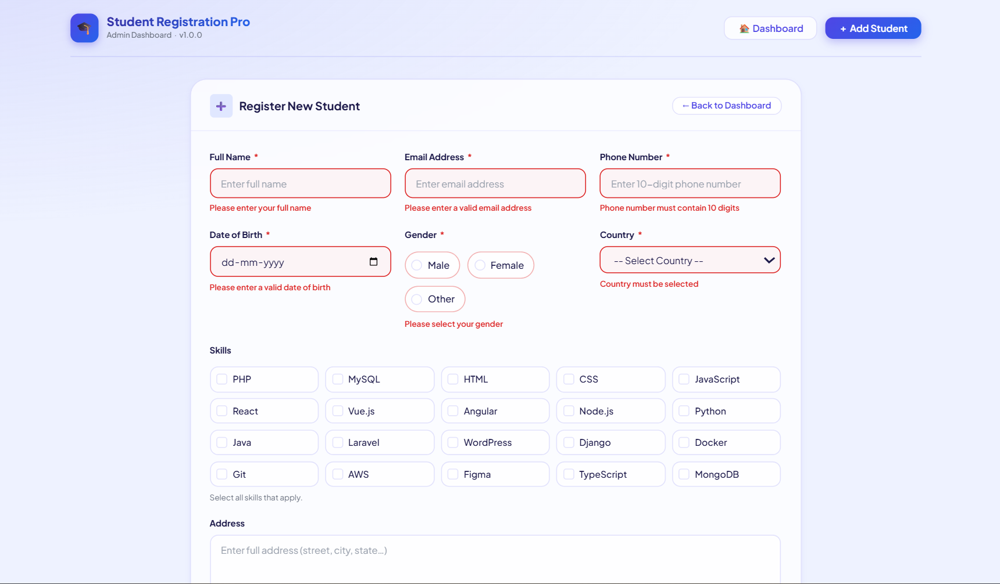
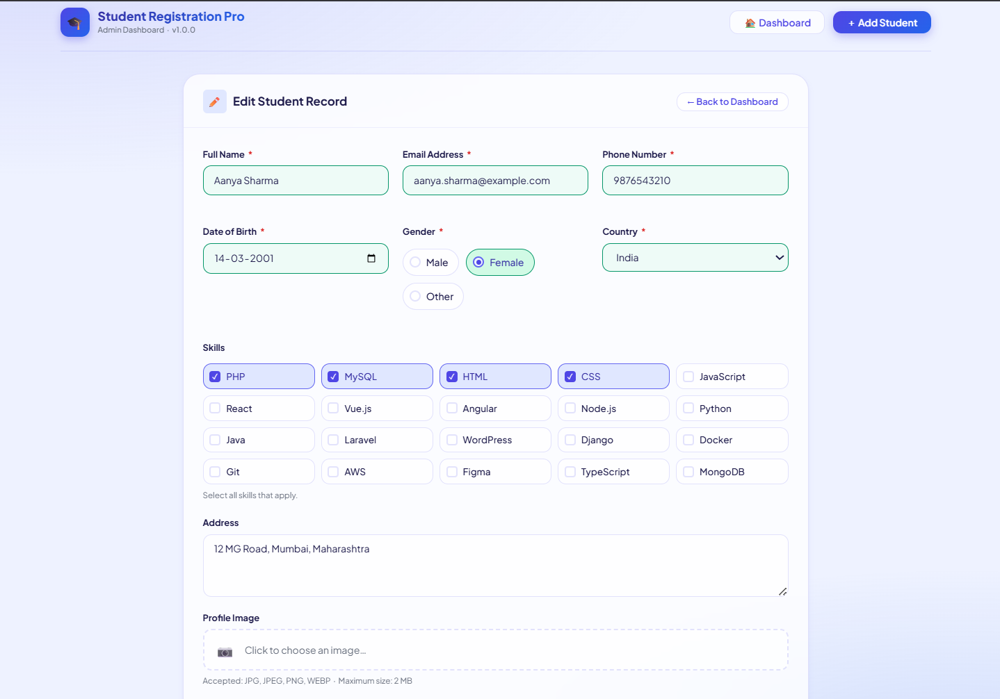
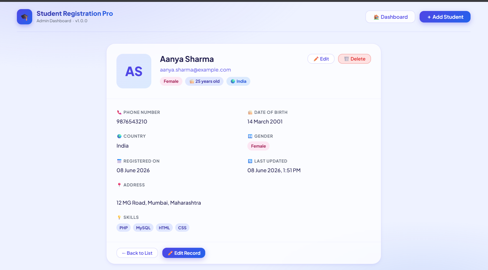
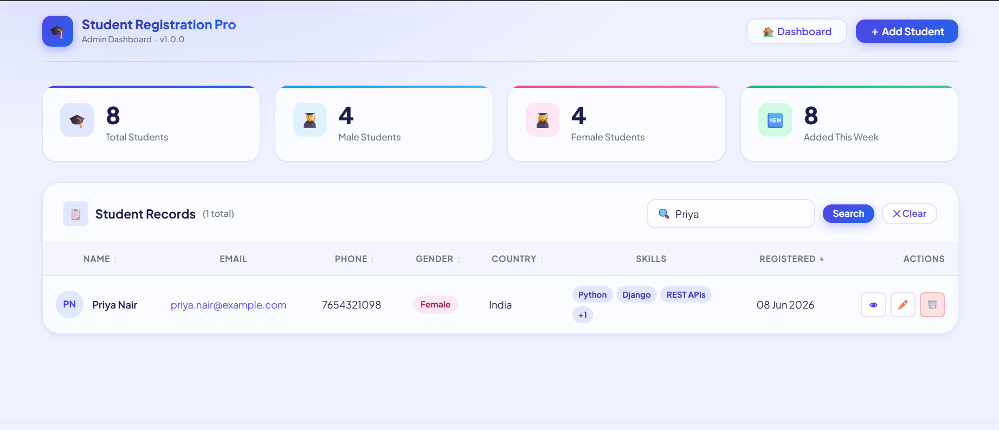

# 🎓 Student Registration Management System

> A professional PHP & MySQL based Student Registration Management System developed using Object-Oriented Programming (OOP), secure database practices, responsive design principles, and complete CRUD functionality.


---

## 📌 Project Overview

The Student Registration Management System is a web-based application designed to streamline the management of student records through an intuitive and responsive interface.

The system enables administrators to register, manage, search, update, and delete student information while ensuring data integrity through robust validation mechanisms and secure database operations.

This project was developed as part of a practical assessment to demonstrate proficiency in:

* PHP Development
* MySQL Database Management
* Object-Oriented Programming (OOP)
* Frontend Development
* CRUD Operations
* Form Validation
* Secure File Handling
* Responsive Web Design

---

# ✨ Key Features

### 👨‍🎓 Student Registration

* Register new students
* Upload profile images
* Store complete student information

### 📋 Student Management

* View all registered students
* Edit student information
* Delete records securely
* Manage student profiles

### 🔍 Advanced Search

Search records instantly using:

* Full Name
* Email Address
* Phone Number
* Country

### ✅ Validation System

#### Frontend Validation (JavaScript)

* Required field validation
* Email format validation
* Phone number validation
* Real-time error handling

#### Backend Validation (PHP)

* Server-side validation
* Input sanitization
* Data verification
* Error management

### 🔐 Security Features

* Prepared Statements (PDO)
* SQL Injection Prevention
* XSS Protection
* Secure File Upload Handling
* Input Sanitization
* Unique File Naming

### 📱 Responsive Design

* Mobile Friendly
* Tablet Friendly
* Desktop Optimized
* Cross-Browser Compatible

---

# 🛠️ Technology Stack

| Technology | Purpose                    |
| ---------- | -------------------------- |
| PHP        | Backend Development        |
| MySQL      | Database Management        |
| HTML5      | Page Structure             |
| CSS3       | Styling & Layout           |
| JavaScript | Validation & Interactivity |
| PDO        | Secure Database Operations |

---

# 📸 Application Preview

## 🏠 Dashboard Overview

The dashboard provides a centralized view of the Student Registration Management System, displaying student records, quick actions, and management features through a clean and responsive interface.



---

## ➕ Add Student

A user-friendly student registration form that allows administrators to enter student details, upload profile images, and store records securely in the database.



---

## ✅ Form Validation

Real-time client-side validation ensures accurate data entry by validating required fields, email formats, phone numbers, and other user inputs before submission.



---

## ✏️ Edit Student Record

Allows administrators to update existing student information efficiently while maintaining data consistency and integrity.



---

## 👤 Student Profile View

Displays complete student information, including personal details, profile image, contact information, skills, and other registered data.



---

## 🔍 Search & Filter Records

Advanced search functionality enables quick filtering of student records using Name, Email Address, Phone Number, and Country.



---

## 🗑️ Delete Confirmation

A confirmation mechanism is implemented before deleting records to prevent accidental data loss and ensure secure record management.


# 🏗️ System Architecture


```text
STUDENT-MANAGEMENT-SYSTEM/
│
├── assets/
│   ├── css/
│   │   └── style.css
│   │
│   ├── js/
│   │   └── app.js
│   │
│   └── img/
│       └── .gitkeep
│
├── classes/
│   ├── Database.php
│   ├── ImageUploader.php
│   ├── Student.php
│   └── Validator.php
│
├── config/
│   ├── config.php
│   └── helpers.php
│
├── controllers/
│   └── StudentController.php
│
├── database/
│   └── schema.sql
│
├── screenshots/
│   ├── 01-dashboard.png
│   ├── 02-add-student.png
│   ├── 03-form-validation.png
│   ├── 04-edit-student.png
│   ├── 05-student-profile.png
│   ├── 06-search-results.png
│   └── 07-delete-confirm.png
│
├── uploads/
│   ├── .htaccess
│   └── index.php
│
├── views/
│   ├── dashboard.php
│   ├── form.php
│   ├── profile.php
│   ├── header.php
│   └── footer.php
│
├── .gitignore
├── .htaccess
├── EXPLANATION.md
├── index.php
└── README.md
```

---
## 📂 Folder Responsibilities

| Folder      | Purpose                                                      |
| ----------- | ------------------------------------------------------------ |
| assets      | Contains CSS, JavaScript and static assets                   |
| classes     | Core OOP classes for database, validation and business logic |
| config      | Application configuration and helper functions               |
| controllers | Handles application requests and CRUD operations             |
| database    | Database schema and SQL scripts                              |
| uploads     | Secure storage for uploaded profile images                   |
| screenshots | Project screenshots for documentation                        |
| views       | User interface templates and layouts                         |


# 🗄️ Database Design

### Student Table

| Field         | Type      |
| ------------- | --------- |
| id            | INT       |
| full_name     | VARCHAR   |
| email         | VARCHAR   |
| phone         | VARCHAR   |
| gender        | VARCHAR   |
| date_of_birth | DATE      |
| country       | VARCHAR   |
| skills        | TEXT      |
| address       | TEXT      |
| profile_image | VARCHAR   |
| created_at    | TIMESTAMP |
| updated_at    | TIMESTAMP |

---

# ⚙️ Installation Guide

## Step 1: Clone Repository

```bash
git clone https://github.com/yourusername/student-registration-management-system.git
```

## Step 2: Move Project

Place project inside:

```text
xampp/htdocs/
```

## Step 3: Create Database

Create a database named:

```sql
student_management
```

## Step 4: Import Database

Import:

```text
database/student_management.sql
```

## Step 5: Configure Database Credentials

Update:

```php
config/database.php
```

## Step 6: Start Services

Start:

* Apache
* MySQL

Open:

```text
http://localhost/student-registration-system
```

---

# 🔒 Security Considerations

This project follows secure coding practices:

✔ Input Sanitization

✔ Prepared Statements

✔ SQL Injection Prevention

✔ XSS Protection

✔ Secure File Upload Validation

✔ Server-Side Validation

✔ Error Handling

✔ Clean OOP Architecture

---

# 🎯 Learning Outcomes

This project demonstrates practical-knowledge of:

* PHP Programming
* OOP Concepts
* Database Integration
* CRUD Development
* Responsive Design
* Form Validation
* MVC-inspired Structure
* Security Best Practices
* Software Development Workflow

---

# 👨‍💻 Developer

### Anubhav Pandey

B.Tech – Information Technology (IT)

Aspiring Web Developer with a strong interest in PHP Development, Database Management, Software Engineering, and Full-Stack Web Applications.

---

# ⭐ Acknowledgement

This project was developed as part of a technical assessment to showcase practical development skills, clean coding practices, problem-solving abilities, and professional software engineering standards.

If you found this project helpful, consider giving it a ⭐ on GitHub.
